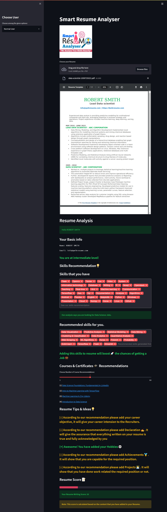

# AI-Powered Resume Screening and Ranking System

## Project Overview

This project is an **AI-Powered Resume Screening and Ranking System** designed to automate and streamline the recruitment process. It leverages **Natural Language Processing (NLP)** and **Machine Learning (ML)** techniques to parse, analyze, and rank resumes based on job-specific requirements. The system aims to reduce manual effort, minimize biases, and improve hiring efficiency by providing recruiters with a structured and data-driven approach to candidate evaluation.

---

## Key Features

### For Applicants:
- **Resume Parsing:** Extracts key information (skills, experience, education, etc.) from unstructured resumes and converts them into a structured format.
- **Personalized Recommendations:** Suggests skills, courses, and resume improvements to enhance job prospects.
- **Resume Scoring:** Provides an overall score based on content relevance and completeness.
- **Interview Tips:** Offers video recommendations for resume writing and interview preparation.

### For Recruiters/Admins:
- **Automated Screening:** Quickly filters and ranks resumes based on predefined criteria.
- **Data Analytics:** Visualizes applicant data through interactive charts (e.g., skill distribution, predicted job roles).
- **Exportable Reports:** Allows downloading applicant data in CSV format for further analysis.
- **Feedback System:** Collects and displays user feedback and ratings.

---

## Technologies Used

### Frontend:
- **Streamlit** (Python library for building interactive web apps)
- **HTML/CSS/JavaScript** (for UI enhancements)

### Backend:
- **Python** (primary programming language)
- **Natural Language Processing (NLP)** (for text extraction and analysis)
- **Machine Learning** (for resume ranking and recommendations)

### Database:
- **MySQL/SQLite** (for storing user data, feedback, and admin credentials)

### Libraries:
- **PyPDF2** (for PDF text extraction)
- **Pandas** (for data manipulation and CSV generation)
- **Matplotlib** (for data visualization)
- **scikit-learn/NLTK** (for NLP and ML tasks)

---

## System Architecture

The system is divided into three main modules:
1. **Client Module:** Handles resume uploads, parsing, and recommendations.
2. **Admin Module:** Provides analytics, user data management, and feedback review.
3. **Feedback Module:** Collects and displays user feedback.

### Data Flow:
1. User uploads a resume.
2. The system parses the resume and extracts relevant information.
3. The extracted data is analyzed and scored.
4. Recommendations and insights are generated for the user.
5. Data is stored in the database for admin access and analytics.

---

## Installation and Setup

### Prerequisites:
- Python 3.8 or higher
- MySQL or SQLite database
- Streamlit (`pip install streamlit`)
- Required Python libraries (`pip install -r requirements.txt`)

### Steps to Run:
1. Clone the repository:
   ```bash
   git clone https://github.com/yourusername/resume-screening-system.git
   cd resume-screening-system
   ```
2. Install dependencies:
   ```bash
   pip install -r requirements.txt
   ```
3. Set up the database:
   - Configure MySQL/SQLite connection in `config.py`.
   - Run the database initialization script (if provided).
4. Launch the Streamlit app:
   ```bash
   streamlit run app.py
   ```
5. Access the application at `http://localhost:8501`.

---

## Screenshots

### User-Side View:


### Admin-Side View:


---

## Future Enhancements
- Integration with **Applicant Tracking Systems (ATS)**.
- Support for **multi-language resume parsing**.
- Enhanced **bias detection and mitigation** in ranking algorithms.
- **Real-time collaboration** for hiring teams.

---

## License
This project is licensed under the **MIT License**. See the [LICENSE](LICENSE) file for details.
